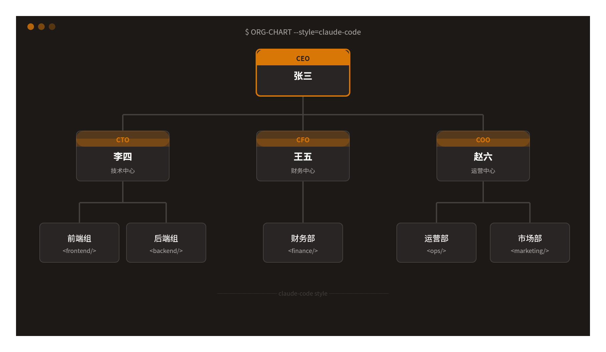
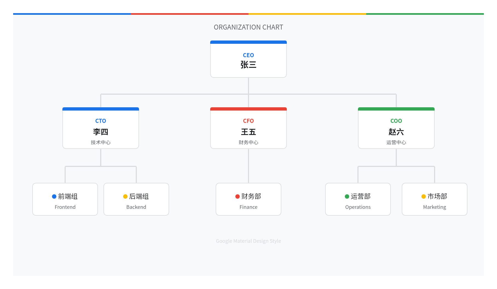
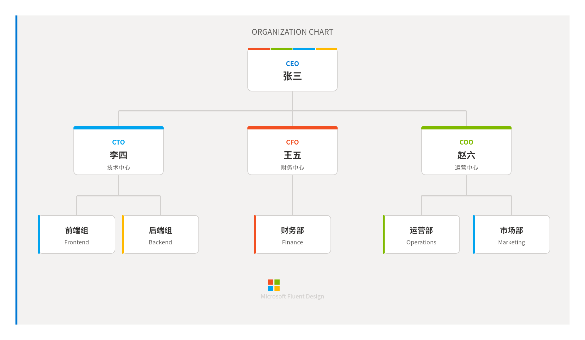
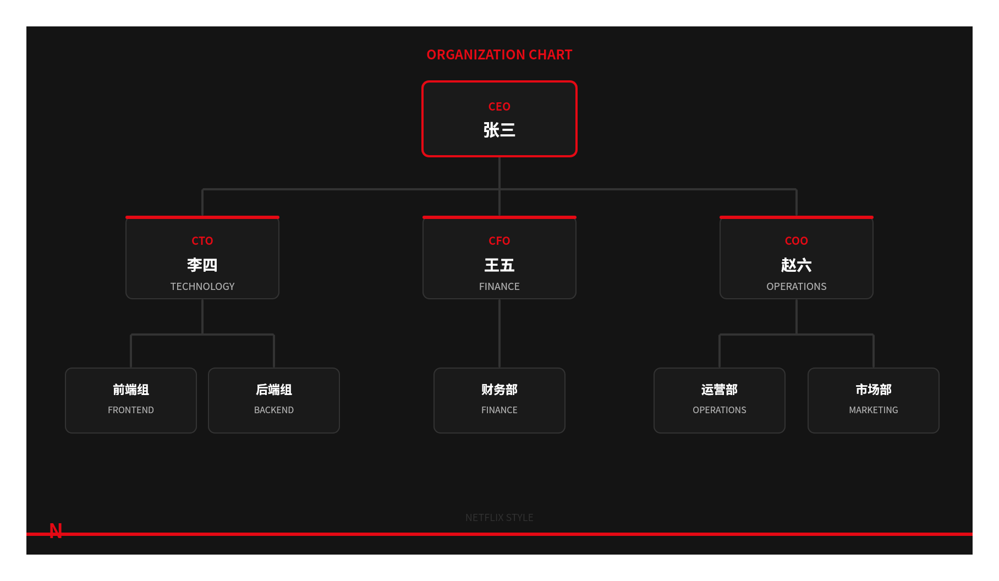
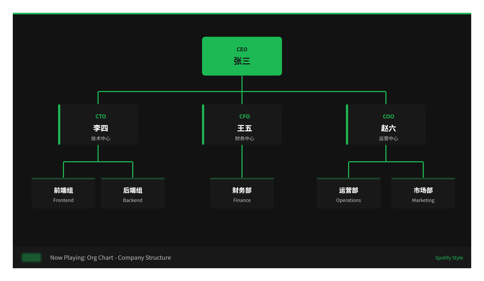
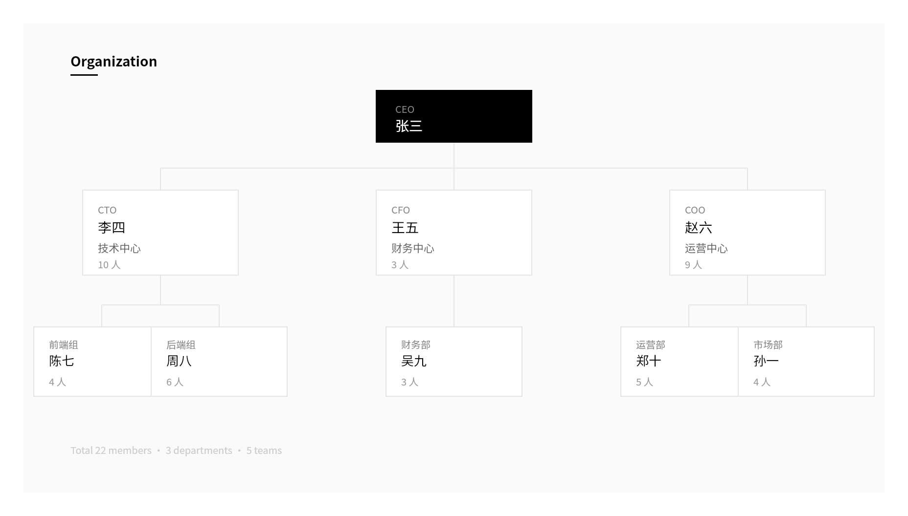
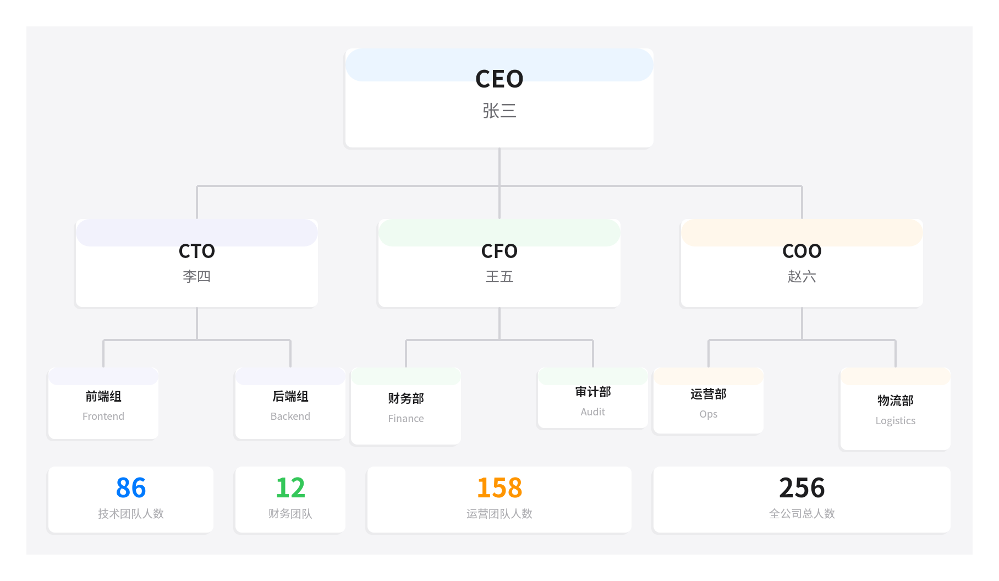
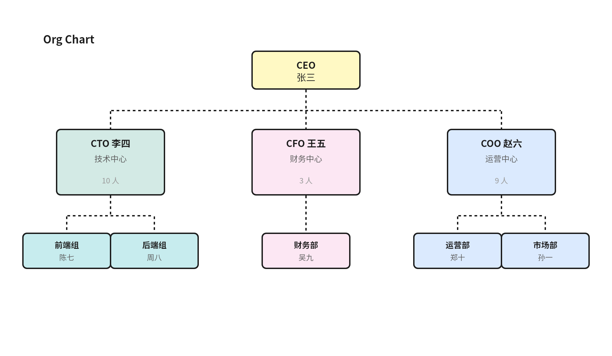
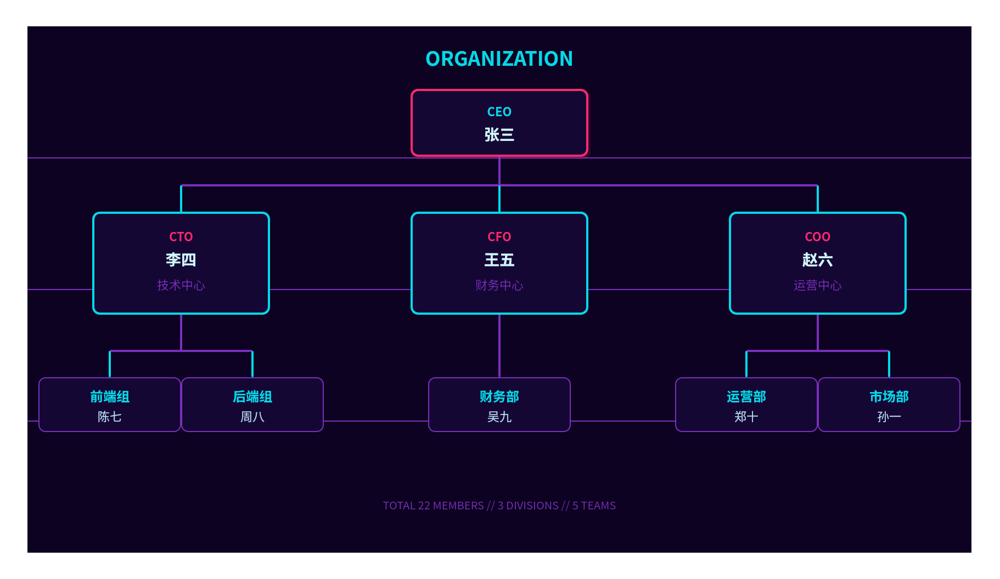
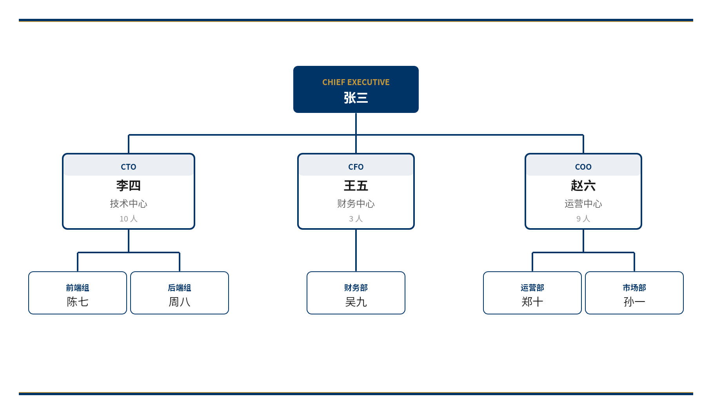

# feishu-whiteboard-themes

**飞书画板主题库** — 为 Claude Code + [lark-cli](https://github.com/larksuite/cli) 画板创作提供 32 种可复用视觉风格模板。

<p align="center">
  <a href="https://github.com/larksuite/cli">
    
  </a>
  
  
</p>

## 关系说明

本 skill 是 [lark-cli](https://github.com/larksuite/cli) 的配套风格库：

```
Claude Code (AI Agent)
  ├── lark-cli                          ← 飞书操作 CLI（创建画板、上传、查询）
  │     └── lark-whiteboard skill       ← 画板渲染引擎（SVG/DSL → 飞书画板）
  │           └── whiteboard-styles     ← 本项目（32 种视觉风格参数）
  └── 用户对话
        "用 Google 风格画个组织架构图"  → 自动匹配风格 → 生成 SVG → 渲染 → 上传飞书画板
```

## 安装

### 前置条件

本主题库是 [lark-cli](https://github.com/larksuite/cli) 的配套 Skill，**需要先安装 lark-cli 才能使用**。

```bash
# 第一步：安装 lark-cli（必须）
# 在 Claude Code 中直接说：
帮我安装这个工具: https://github.com/larksuite/cli

# 第二步：安装本主题库（必须）
# 在 Claude Code 中直接说：
帮我安装这个 skill: https://github.com/inhai-wiki/feishu-whiteboard-themes
```

手动安装：

```bash
# 1. 先安装 lark-cli
#    参考 https://github.com/larksuite/cli

# 2. 再安装本主题库
git clone https://github.com/inhai-wiki/feishu-whiteboard-themes.git ~/.claude/skills/feishu-whiteboard-themes
```

> 如果只安装了本主题库而没有安装 lark-cli，在对话中画图时 AI 会自动引导你完成 lark-cli 的安装。

## 使用方式

安装后，在 Claude Code 对话中画图时直接指定风格：

```
画一个组织架构图，用 Google 风格
```

```
帮我画个技术架构图，Claude Code 风格
```

```
用 Netflix 风格画个流程图
```

```
画个组织架构图存到飞书画板，用 Microsoft 风格
```

不指定风格时，skill 会根据图表类型和场景自动推荐最合适的风格。

## 全部风格（32 种）

### 全球科技公司

| # | 风格 ID | 预览 | 关键词 |
|---|---|---|---|
| 23 | `claude-code` |  | 暖橙棕终端感、AI 原生 |
| 24 | `google` |  | 四色品牌、Material You |
| 25 | `microsoft` |  | Fluent Design、四色方格 |
| 26 | `meta` | | 渐变蓝、现代社交科技 |
| 27 | `amazon` | | 深蓝橙、云计算企业级 |
| 28 | `netflix` |  | 深黑红、电影沉浸感 |
| 29 | `spotify` |  | 深绿黑、活力绿 |
| 30 | `tesla` | | 极简黑白红、工程美学 |
| 31 | `openai` | | 柔和绿、AI 前沿 |
| 32 | `bytedance` | | 黑白粉青、短视频活力 |

### 设计工具 & 协作平台

| # | 风格 ID | 预览 | 关键词 |
|---|---|---|---|
| 1 | `vercel` |  | 黑白灰、零圆角、工程师美学 |
| 2 | `apple` |  | 大圆角、精致留白 |
| 3 | `notion` | | 超轻边框、文档内嵌感 |
| 4 | `figma` | | 彩色标签、网格系统 |
| 5 | `excalidraw` |  | 手绘线条、便签黄、白板协作 |
| 6 | `miro` | | 彩色便利贴、团队协作 |
| 7 | `material` | | Google 设计语言、阴影层级 |
| 8 | `ant-design` | | 阿里设计体系、专业蓝 |
| 9 | `github` | | 深色代码感、等宽风 |
| 10 | `stripe` | | 精致渐变、科技紫 |
| 11 | `linear` | | 深色、紫色调、项目管理 |
| 12 | `whimsical` | | 柔和圆角、淡彩 |
| 13 | `lucidchart` | | 标准流程图、企业蓝灰 |

### 通用设计风格

| # | 风格 ID | 预览 | 关键词 |
|---|---|---|---|
| 14 | `dark-mode` | | 深色背景、高对比、护眼 |
| 15 | `neon` |  | 霓虹发光、未来感 |
| 16 | `blueprint` | | 深蓝底色、工程图纸 |
| 17 | `pastel` | | 柔和淡彩、温馨 |
| 18 | `corporate` |  | 深蓝金配色、稳重 |
| 19 | `minimal` | | 最少元素、最大留白 |
| 20 | `monochrome` | | 纯黑白、无彩色 |
| 21 | `isometric` | | 等距投影、立体感 |
| 22 | `duotone` | | 两色高对比、海报感 |

## 文件结构

```
feishu-whiteboard-themes/
├── SKILL.md                          # 主入口：触发规则、工作流、风格路由
├── README.md                         # 本文件
├── examples/                         # 风格示例截图
│   ├── claude-code.png
│   ├── google.png
│   ├── microsoft.png
│   ├── netflix.png
│   ├── spotify.png
│   ├── vercel.png
│   ├── excalidraw.png
│   ├── neon.png
│   ├── apple.png
│   └── corporate.png
└── references/
    ├── style-catalog.md              # 完整风格参数库（配色、形状、字体、连线）
    └── scene-style-mapping.md        # 图表类型 × 场景 × 推荐风格映射
```

## 每个风格包含的参数

- **palette** — 配色方案（背景、卡片、主色、边框、文字、强调色）
- **shape** — 形状参数（圆角、边框宽度、阴影）
- **typography** — 字体规范（字号层级、字重、字间距、大小写）
- **connector** — 连线风格（颜色、宽度、虚线/实线）
- **decoration** — 装饰规则（渐变、图标风格、额外点缀）

## 图标支持

图表中如需使用图标，推荐使用 [FontAwesome](https://fontawesome.com/) 图标库，通过 CDN 引入：

```xml
<!-- 在 SVG <style> 中引入 -->
<style>
  @import url('https://cdnjs.cloudflare.com/ajax/libs/font-awesome/6.5.1/css/all.min.css');
  text { font-family: "SF Pro Display", "Noto Sans SC", sans-serif; }
</style>

<!-- 使用 FontAwesome 图标 -->
<text font-family="'Font Awesome 6 Free'" font-weight="900" font-size="14" fill="#666">&#xf007;</text>
```

## License

MIT
